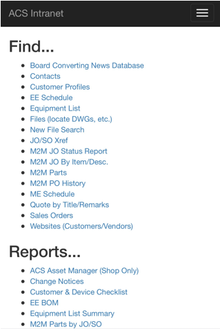

# ACS Intranet

**12/18/2017 update**
* Created site layout
* Nothing really functional yet, just an update to the old look
* Scales well on phones
>
* Hosting the development server on my laptop in ACS office
    * http://bfairburn3:6699
----------------------

#### Build Instructions
Clone repo  

> `git clone https://acscode.visualstudio.com/_git/acs-intranet`

or use the site navigation to download code as a .zip. Open solution in Visual Studio 2017 and build/run in debug mode to test. Details on deploying to IIS can be found [here](https://docs.microsoft.com/en-us/aspnet/core/publishing/iis?tabs=aspnetcore2x).