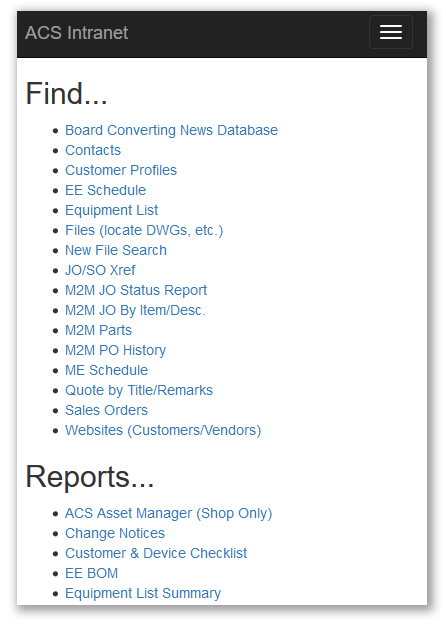

# **ACS Intranet**

**12/18/2017 update**
* Created site layout
* Nothing really functional yet, just an update to the old look
* Scales well on phones - 
* Hosting the development server on my laptop in ACS office
    * http://bfairburn3:6699

----------------------

## Build Instructions
Clone repo  

> `git clone https://acscode.visualstudio.com/_git/ACS%20Intranet`

or use the site navigation to download code as a .zip. Open solution in Visual Studio 2017 and build/run in debug mode to test. Details on deploying to IIS can be found [here](https://docs.microsoft.com/en-us/aspnet/core/publishing/iis?tabs=aspnetcore2x).

----------------------

## Project Structure

* `wwwroot/`
  - resources for site (images, CSS, JavaScript, etc)

* `Pages/`
  - Razor pages 
    - See Microsoft documentation on [Razor Pages](https://docs.microsoft.com/en-us/aspnet/core/mvc/razor-pages/?tabs=visual-studio) and [MVVM pattern](https://msdn.microsoft.com/en-us/library/hh848246.aspx)
    - Files starting with an underscore are 'resources' like layouts or real-time [form validation](https://docs.microsoft.com/en-us/aspnet/core/tutorials/razor-pages/validation)
    - `.cshtml` files are the design for pages and include HTML and scripting in C# *(note: in-page scripting ONLY for logic directly responsible for rendering HTML)*
    - "Code-Behind" files (`*.cshtml.cs`) do the heavy-lifting logic for pages, such as database interaction or HTTP request handling

* `Program.cs` is the entry point (`Main` method) for starting the server, and defines which class to use for startup.
  - can define settings like login authentication and URLs/ports to listen on, but when using IIS as a proxy server this is handled externally

* `Startup.cs` contains startup settings and is called automatically by the runtime. 
----------------------

#### Screenshots
**Desktop**
>

**Mobile**
>
click mobile screenshot for GIF demo
